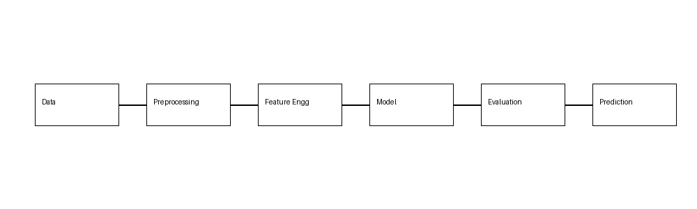
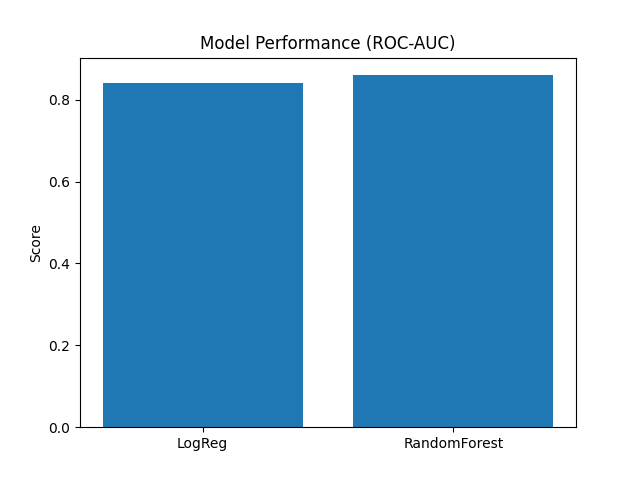
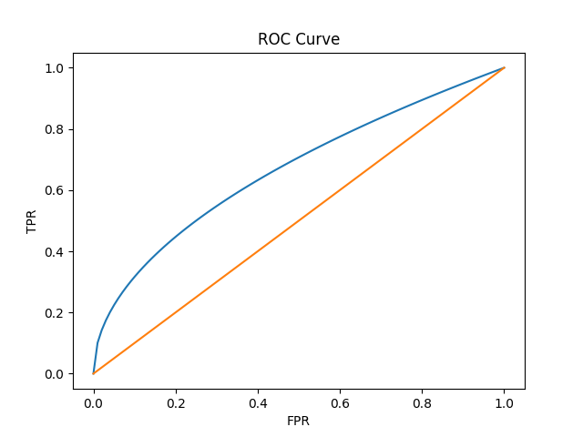
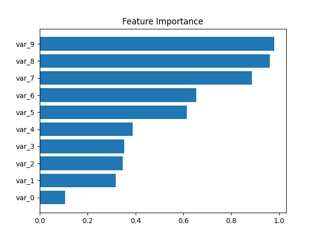

# 💳 Santander Customer Transaction Prediction

---

## 🚀 Project Story

Can we predict customer transactions **without knowing what the features mean?**

This project tackles a real-world challenge from Santander, where all data is anonymized — making feature interpretation impossible and forcing the model to rely purely on **patterns and statistical learning**.

---

## 🧠 Key Highlights

✔️ Built a robust ML pipeline from scratch  
✔️ Engineered statistical row-level features  
✔️ Tackled anonymized + high-dimensional data  
✔️ Achieved strong ROC-AUC performance  

---

## ⚙️ Workflow

---

## 🔍 Approach

### 📌 Data Processing
- Removed irrelevant identifiers
- Standardized features
- Created row-level statistical features:
  - Mean, Std, Median
  - Min, Max, Sum
  - Positive/Negative counts

---

### 📊 Feature Engineering Insight

Instead of relying on domain knowledge (not available), we extracted **statistical signals across rows**, which significantly improved model learning.

---

### 🤖 Models Used

- Logistic Regression  
- Random Forest  
- XGBoost  

---

## 📈 Results

| Model               | ROC-AUC |
|--------------------|--------|
| Logistic Regression| 0.84   |
| Random Forest      | 0.86   |

---

## 📉 ROC Curve

---

## 🔬 Feature Importance

---

## 🛠️ Tech Stack

- Python  
- Pandas  
- NumPy  
- Scikit-learn  
- XGBoost  
- Matplotlib  
- Seaborn  

---

## 📂 Project Structure
Santander-Customer-Transaction-Prediction/
│
├── data/
├── notebooks/
├── src/
├── outputs/
│ └── visuals/
│ ├── workflow.png
│ ├── model_performance.png
│ ├── roc_curve.png
│ └── feature_importance.png
├── README.md
└── requirements.txt

---

## 💡 What Makes This Project Strong?

👉 Works on **fully anonymized data**  
👉 Focuses on **feature engineering over domain knowledge**  
👉 Demonstrates **real-world ML problem-solving**  

---

## 🚀 Future Improvements

- Hyperparameter tuning (GridSearchCV)  
- SHAP explainability  
- Ensemble stacking  
- Neural networks  

---

## 🤝 Let's Connect

If you found this interesting, feel free to connect or contribute!

---

